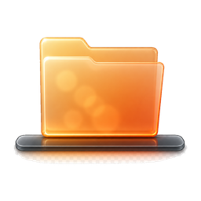

# FolderDock


[](https://www.codefactor.io/repository/github/zkelo/folderdock)

[English](README.md) | **Русский**

Папки на панели задач Windows 11 — как в Dock на macOS. Клик по закреплённому значку папки → всплывающее окно с содержимым (сетка или список) прямо над панелью задач, без Проводника.

## Возможности

- **Закрепление любой папки** на панели задач через ярлык с собственным AppUserModelID — каждая папка получает отдельную кнопку, они не группируются между собой.
- **Popup над панелью задач**: сетка с миниатюрами (изображения — превью) или компактный список. Переключение кнопкой в заголовке.
- Клик по файлу → открытие приложением по умолчанию **с контекстом папки** (`NeighboringFilesQuery`): в «Фото» и других просмотрщиках стрелки листают к следующему/предыдущему файлу, ровно как при открытии из Проводника. Popup закрывается.
- Клик по подпапке → навигация внутрь прямо в popup; кнопка **«Назад»** возвращает к папке уровнем выше.
- **Типизированный drag-and-drop**: пакет данных содержит несколько представлений — картинки дополнительно кладутся как Bitmap (вставка «как картинка» в Paint/Word/мессенджеры), текстовые файлы — как Text (вставка содержимого в редактор), и всегда StorageItems (файлы для Проводника и всего остального). Приложение-приёмник само выбирает формат, который понимает. Перетаскивание **перемещает** объект (как в Проводнике); с зажатым **Ctrl** — копирует. После перемещения содержимое попапа обновляется автоматически.
- **Контекстное меню Проводника** (ПКМ по элементу): настоящее системное меню шелла — «Открыть с помощью», «Отправить», Копировать/Вырезать/Удалить/Переименовать, сторонние расширения (7-Zip, TortoiseGit, …) — ровно как в Проводнике. То же меню доступно на строках менеджера: ПКМ по закреплённой папке → **«Закрепить на панели задач»**, переименовать или удалить ярлык — без перехода в Проводник.
- Кнопка «Открыть в Проводнике».
- Клик мимо окна → popup закрывается (поведение флайаута).
- Повторный клик по значку → toggle (закрыть).
- Менеджер показывает только «живые» закрепления: ярлыки, чья целевая папка удалена, отфильтровываются при каждой активации окна.
- **Обновления из GitHub Releases**: кнопка «Проверить обновления» и тумблер автопроверки при запуске (хранится в `%LOCALAPPDATA%\FolderDock\settings.json`). При выходе новой версии приложение предлагает скачать установщик под вашу архитектуру и запускает тихое обновление.
- Запуск с ярлыка самого приложения (меню Пуск) сохраняет собственную идентичность на панели задач — программа не «притворяется» одной из закреплённых папок.
- Тёмная/светлая тема — системная. Скруглённые углы Win11, поверх окон, нет в Alt-Tab.
- Single-instance: повторные запуски перенаправляются работающему экземпляру (AppInstance redirect).

## Установка

Скачай `FolderDock-Setup-<версия>-<арх>.exe` из [Releases](https://github.com/zkelo/FolderDock/releases) и запусти. Установщик позволяет выбрать папку установки, опционально создаёт группу в меню «Пуск» и тихо удаляет ранее установленную версию перед обновлением.

## Сборка (на Windows)

Требования:
- Windows 10 17763+ / Windows 11
- [.NET 8 SDK](https://dotnet.microsoft.com/download/dotnet/8.0)
- Visual Studio 2022 с workload **Windows application development** — или только SDK + командная строка

Командная строка:

```powershell
cd FolderDock
dotnet build -c Release -p:Platform=x64
# или сразу готовый exe (self-contained, WindowsAppSDKSelfContained — MSIX не нужен):
dotnet publish -c Release -r win-x64 -p:Platform=x64
```

Результат: `bin\x64\Release\net8.0-windows10.0.19041.0\win-x64\publish\FolderDock.exe`

> WinUI 3 не собирается на Linux/macOS (XamlCompiler.exe — только Windows). Собирать на Windows.

## Использование

1. Запусти `FolderDock.exe` без аргументов → окно-менеджер.
2. «Добавить папку» → выбери папку → создаётся ярлык в `%LOCALAPPDATA%\FolderDock\Shortcuts`.
3. ПКМ по папке в списке → **«Закрепить на панели задач»** (настоящее меню Проводника — закрепление, переименование, удаление, свойства без выхода из менеджера).
4. Клик по закреплённому значку → popup с содержимым папки.

Так можно закрепить сколько угодно папок — у каждой свой значок.

## Локализация

Языки интерфейса: **English (en-US, по умолчанию)**, **Русский (ru)**, **Українська (uk)**. Язык выбирается по списку предпочитаемых языков Windows; отсутствующие строки откатываются к английскому.

Все строки — в одном файле на язык: `Strings/<тег BCP-47>/Resources.resw`. Чтобы добавить язык:

1. Скопируй `Strings/en-US/` в `Strings/<твой тег>/` (например, `Strings/de-DE/`).
2. Переведи элементы `<value>` — ключи должны совпадать во всех языках.
3. Пересобери. Всё — без правок кода: WinUI PRI подхватывает папку автоматически.

Соглашения о ключах: ключи с точкой (`AddFolderLabel.Text`) привязываются к XAML-элементам через `x:Uid`; простые ключи (`Update_Checking`) используются из кода через `Loc.Get`/`Loc.Format` (`{0}`, `{1}` — подстановки, сохраняй их в переводах).

## Как это работает

- Windows 11 не даёт закрепить папку на панель задач напрямую и не имеет API для popup «из панели». Обход: ярлык на `FolderDock.exe --folder "<путь>"` с записанным в property store ярлыка `System.AppUserModel.ID`, уникальным для каждой папки (SHA1 от пути). Процесс при старте ставит себе тот же AUMID через `SetCurrentProcessExplicitAppUserModelID` — панель задач сопоставляет окно с нужным закреплённым значком. При запуске без `--folder` процесс (и каждое окно через `SHGetPropertyStoreForWindow`) использует собственный AUMID приложения.
- Один фоновый процесс: `AppInstance.FindOrRegisterForKey` + `RedirectActivationToAsync`. Клик по любому ярлыку попадает в живой экземпляр → мгновенный popup без холодного старта.
- Popup — WinUI 3 `Window` c `OverlappedPresenter.CreateForContextMenu()` (без рамки), `IsAlwaysOnTop`, `WS_EX_TOOLWINDOW` (нет в Alt-Tab), `DWMWA_WINDOW_CORNER_PREFERENCE=ROUND`. Позиционирование — по курсору, прижат к верхнему краю рабочей области над панелью задач.
- Миниатюры — `StorageFile.GetThumbnailAsync` (те же превью, что в Проводнике), грузятся асинхронно после показа окна.

## Структура

| Файл | Назначение |
|---|---|
| `Program.cs` | Точка входа: single-instance, redirect активаций, AUMID процесса |
| `CommandLine.cs` | Токенизация `--folder` из аргументов |
| `App.xaml(.cs)` | Роутинг активаций: popup или менеджер |
| `PopupWindow.xaml(.cs)` | Всплывающее окно: события UI, toggle, навигация назад |
| `PopupChrome.cs` | Оформление окна: presenter, DWM, позиционирование, Share interop |
| `PopupLayout.cs` | Чистая математика размеров попапа (константы связаны с XAML) |
| `ShareCoordinator.cs` | Поток Share: DataTransferManager, состояние, защита light-dismiss |
| `FolderEntry.cs` | Модель элемента папки |
| `FolderContents.cs` | Результат чтения: элементы + признак ошибки доступа |
| `FolderReader.cs` | Чтение содержимого папки |
| `ThumbnailLoader.cs` | Асинхронные миниатюры Проводника (с отменой) |
| `TypedDataPackage.cs` | DataPackage: Bitmap/Text/StorageItems; синхронное заполнение для драга |
| `ShellContextMenu.cs` | Контекстное меню шелла Проводника: IContextMenu/2/3, сабклассинг для сообщений меню |
| `ManagerWindow.xaml(.cs)` | Менеджер: добавление папок, ярлыки, фильтрация «мёртвых» закреплений |
| `PinInfo.cs` | Модель строки списка менеджера |
| `AppInfo.cs` | Версия, момент сборки, ссылка на репозиторий для UI |
| `Localization.cs` | `Loc.Get`/`Loc.Format` — доступ к строкам .resw |
| `Strings/<язык>/Resources.resw` | Строки UI по языкам (en-US, ru, uk) |
| `Settings.cs` | JSON-настройки в `%LOCALAPPDATA%\FolderDock` |
| `UpdateService.cs` | Проверка обновлений через GitHub Releases API, скачивание установщика |
| `ShortcutFactory.cs` | COM IShellLink + IPropertyStore: .lnk с AUMID, чтение аргументов |
| `FolderAumid.cs` | AppUserModelID из пути папки |
| `WindowAumid.cs` | AUMID уровня окна через SHGetPropertyStoreForWindow |
| `PropertyStoreInterop.cs` | Общие COM-типы: IPropertyStore, PropertyKey, PropVariant |
| `Shell.cs` | Запуск файлов (URI «Фото» / NeighboringFilesQuery) и Проводника |
| `FileAssociation.cs` | Определение приложения по умолчанию для расширения (AssocQueryString) |
| `Native.cs` | Win32/COM: DWM, курсор, DPI, стили окна, Share interop |
| `installer/FolderDock.iss` | Скрипт Inno Setup (путь установки, меню Пуск, MIT, апгрейд) |

## Ограничения

- Закрепление на панель — вручную через ПКМ (программный pin Windows не разрешает сторонним приложениям).
- Первый клик после перезагрузки — холодный старт (~1–2 с), дальше мгновенно.
- Иконка ярлыка — стандартная папка из imageres; можно сменить в свойствах ярлыка.

## Политика подписи кода (Code signing policy)

Free code signing provided by [SignPath.io](https://about.signpath.io), certificate by [SignPath Foundation](https://signpath.org).

Релизные бинарники (`FolderDock.exe` и установщики) собираются из этого репозитория в [GitHub Actions](.github/workflows/release.yml); на подпись в SignPath отправляются только артефакты, собранные CI. Закрытый ключ хранится в HSM на стороне SignPath — проект его не хранит.

Роли (проект с одним мейнтейнером):

- Авторы (право коммита): [zkelo](https://github.com/zkelo)
- Ревьюеры: [zkelo](https://github.com/zkelo) — все внешние pull request'ы проходят ревью мейнтейнера до слияния.
- Утверждающие: [zkelo](https://github.com/zkelo) — каждый запрос на подпись требует явного одобрения мейнтейнера.

### Политика конфиденциальности

Программа не передаёт никакую информацию другим сетевым системам, кроме случаев, когда это явно запрошено пользователем. Исключение: необязательная проверка обновлений обращается к GitHub API (`api.github.com`) за версией последнего релиза; её можно отключить в настройках приложения (`autoCheckUpdates`).

## Лицензия

[MIT](LICENSE)
